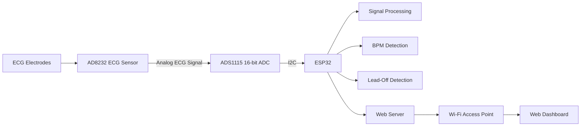

PulseAI – Smart ECG Monitoring and Arrhythmia Detection System

> An ESP32-based ECG monitoring prototype for real-time ECG acquisition, signal processing, heart-rate estimation, and web-based visualization.

 📌 Overview

PulseAI is an embedded ECG monitoring system developed using **ESP32, AD8232, and ADS1115**.

The system acquires ECG signals through the AD8232 sensor, converts the analog signal using the ADS1115 ADC, processes the signal using digital filtering, and displays the ECG waveform through a web dashboard hosted by the ESP32.

The system architecture can be extended for advanced ECG analysis and arrhythmia detection.

✨ Features

- Real-time ECG signal acquisition
- AD8232 ECG sensor interface
- ADS1115 16-bit ADC
- Moving-average filtering
- IIR signal smoothing
- Basic BPM estimation
- Electrode lead-off detection
- Real-time ECG waveform visualization
- ESP32 Wi-Fi Access Point
- Browser-based monitoring dashboard
- ECG ADC value monitoring
- CSV data download
- ECG report printing
- Modular Embedded C/C++ firmware

---

## 🏗️ System Architecture

---
